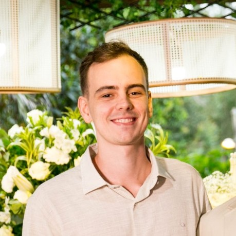

<h1 style="text-align: center; font-size: 2.5em">Mateus Ferreira</h1>

  

<h2 style="text-align: center;">Software Engineer</h2>

 

Hello 👋

I'm a Brazilian Software Engineer who loves to build awesome things with technology.

<h2 style="font-size: 2em; text-align: center; margin: 60px 0 20px 0">🔧 Technologies</h2>

<h4  style="text-align: center;">That I've been working with on a daily basis</h4>

(Javascript, Typescript, Node.js, Docker, Postgresql, Git, Jest)

<h4  style="text-align: center;">That I use sometimes or have used for a while</h4>

(Python, AWS, Angular.js, React.js)

<h2 style="font-size: 2em; text-align: center; margin: 60px 0 20px 0">👨‍💻 Professional Experience</h2>

**MaisTodos** (Jun 2022 - currently) -
Ribeirão Preto - Brazil

I've been acting as a full-stack engineer on cashback products, colaborating to the entire development lifecycle including development, testing, bug fixing, code review, requirements analisys, etc.

*Tools: Javascript, Typescript, Node.js, Angular.js, Python, Postgresql, Docker, Jest, Git*

---

**Anbetec** (Feb 2022 - Jun 2022) -
Goiânia - Brazil

Contributed to the development of REST APIs and integrations to ERP systems for a short period of time.

*Tools: Javascript, Typescript, Node.js, Oracle DB, Docker, Jest, Git*

---

**Haittane** (Jul 2021 - Feb 2022) - São Paulo - Brazil

Acted as a full-stack engineer on various products such as REST APIs and websites for different clients. Actively contributed to the development of software features and POCs, as well as bug fixing.

*Tools: Javascript, Typescript, Node.js, React.js, MySQL, Docker, Git*

<h2 style="font-size: 2em; text-align: center; margin: 60px 0 20px 0">🏫 Education</h2>

**Faculdade Impacta** (Feb 2021 - Dec 2023) - São Paulo - Brazil

Software Analisys and Development (Technologist Degree)

<h2 style="font-size: 2em; text-align: center; margin: 40px 0">🌐 Languages</h2>

🇵🇹🇧🇷 Portuguese (Native)

🏴󠁧󠁢󠁥󠁮󠁧󠁿🇺🇲 English (Fluent)

🇪🇸🇦🇷 Spanish (Advanced)

<h2 style="font-size: 2em; text-align: center; margin: 40px 0">🤝 Soft Skills</h2>

🗣️ Communication

🧑🏿‍🤝‍🧑🏻 Team Player

🤔 Curiousity

💡Fast learning

<h2 style="font-size: 2em; text-align: center; margin: 40px 0">🖌️ Hobbies</h2>

👨‍🍳 Cooking

🎸 Music

⚽ Football

